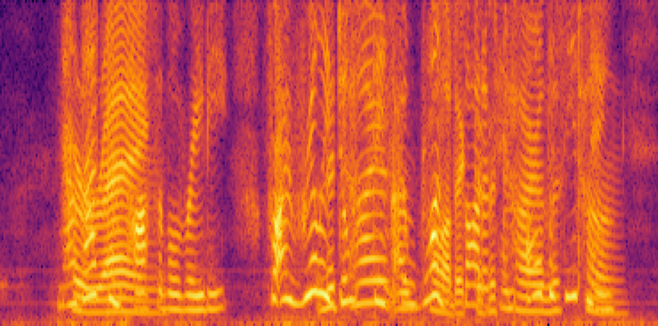
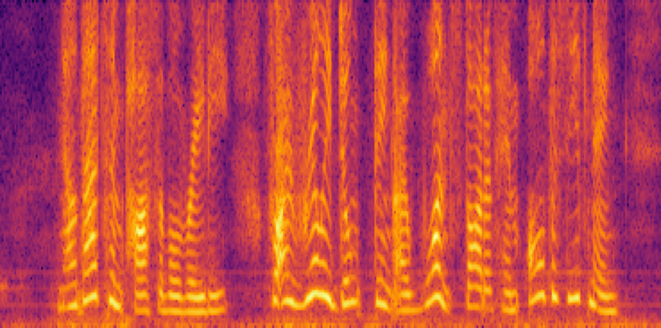
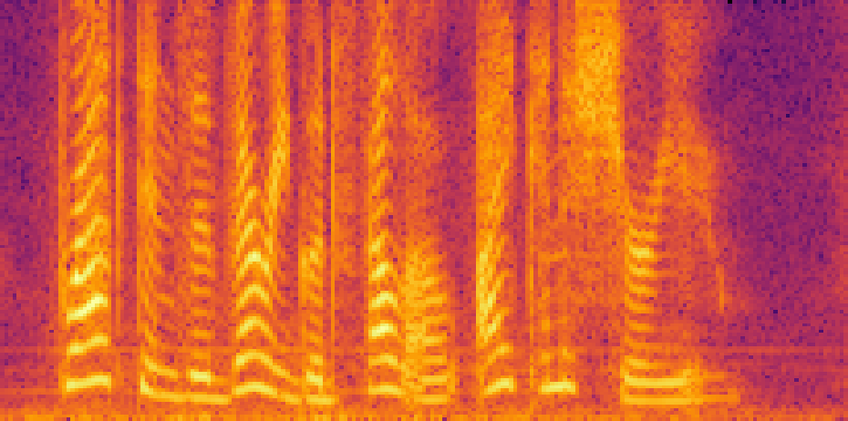
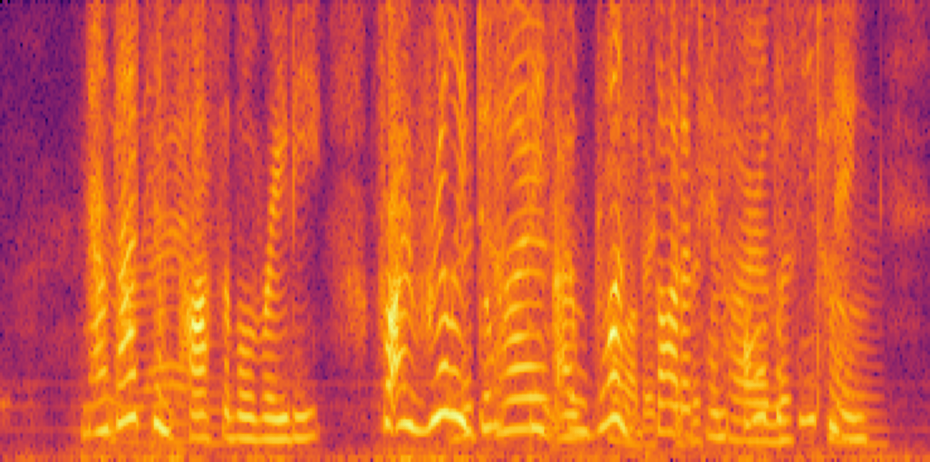
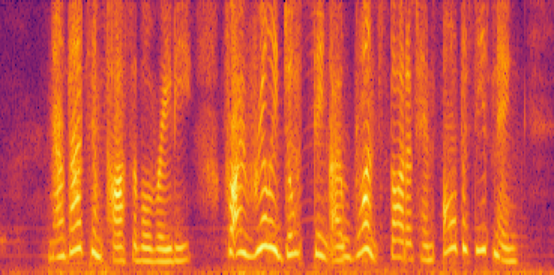
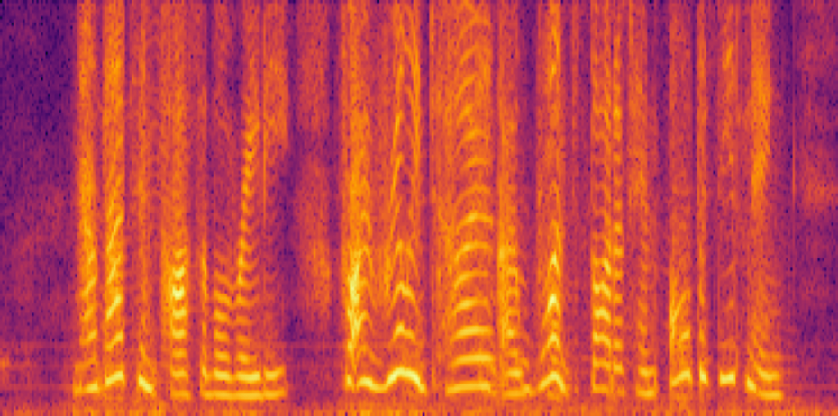
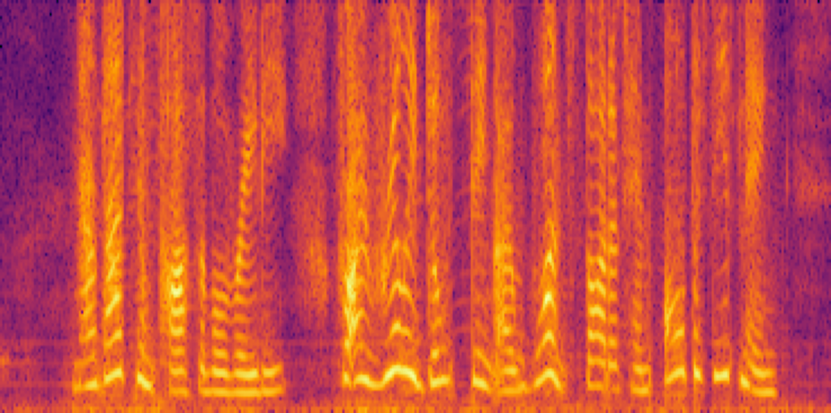

## Target Speech Separation Demonstration

This tiny demonstration of target speech separation is a part of my bachelor thesis. Below are examples of the mixture, target, and reference audio.

| 
Mixture
 | 
Target
 | 
Reference
 |
| :---: | :---: | :---: |
|<audio src="audio/mix.wav" controls preload></audio>|<audio src="audio/target.wav" controls preload></audio>|<audio src="audio/reference.wav" controls preload>|
||||

## Estimated audio
The estimated audio samples were obtained using the DPRNN-Spe model. Below are examples of different fusion types, including Addition, Attention, Concatenation, FiLM, and Multiplication.

| | 
Target
 | 
Concatenation
 | 
Attention
 |  
Multiplication
 | 
FiLM
 | 
Addition
 |
| :---: | :---: | :---: | :---: | :---: | :---: | :---: |
| Spectrogram |||||||
| Audio |<audio src="audio/target.wav" controls preload></audio>|<audio src="audio/estimated_spe_cat.wav" controls preload></audio>|<audio src="audio/estimated_spe_att.wav" controls preload></audio>|<audio src="audio/estimated_spe_mul.wav" controls preload></audio>|<audio src="audio/estimated_spe_film.wav" controls preload></audio>|<audio src="audio/estimated_spe_add.wav" controls preload></audio>|
| 
SI-SDR
 | -- | 18.50 | 17.40 | 17.13 | 9.97 | 9.34 |

## Close-up examples
Below are close-up examples of different fusion types:

| 
Target
 | 
Concatenation
 | 
| :---: | :---: |
|<audio src="audio/target.wav" controls preload></audio>|<audio src="audio/estimated_spe_cat.wav" controls preload></audio>|
|||

| 
Target
 | 
Attention
 |
| :---: | :---: |
|<audio src="audio/target.wav" controls preload></audio>|<audio src="audio/estimated_spe_att.wav" controls preload></audio>|
|||

| 
Target
 | 
Multiplicatio
 |
| :---: | :---: |
|<audio src="audio/target.wav" controls preload></audio>|<audio src="audio/estimated_spe_mul.wav" controls preload></audio>|
|||

| 
Target
 | 
FiLM
 |
| :---: | :---: |
|<audio src="audio/target.wav" controls preload></audio>|<audio src="audio/estimated_spe_film.wav" controls preload></audio>|
|||

| 
Target
 | 
Addition
 |
| :---: | :---: |
|<audio src="audio/target.wav" controls preload></audio>|<audio src="audio/estimated_spe_add.wav" controls preload></audio>|
|||
