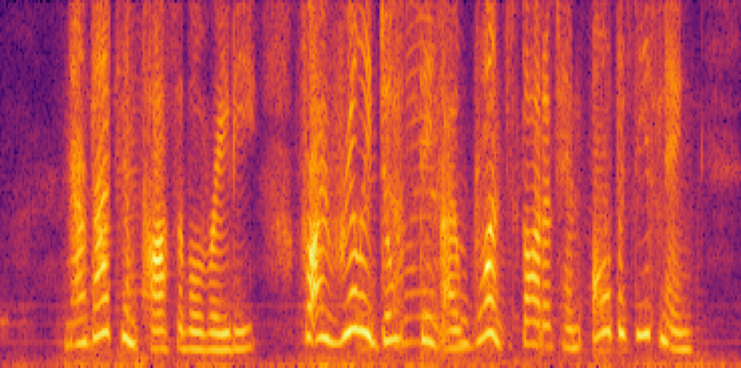

| 
Mixture
 | 
Target
 | 
Reference
 |
| :---: | :---: | :---: |
|<audio src="audio/mix.wav" controls preload></audio>|<audio src="audio/target.wav" controls preload></audio>|<audio src="audio/reference.wav" controls preload>|
||||

| 
Target
 | 
Addition
 | 
| :---: | :---: |
|<audio src="audio/target.wav" controls preload></audio>|<audio src="audio/estimated_spe_add.wav" controls preload></audio>|
|||

| 
Target
 | 
Attention
 |
| :---: | :---: |
|<audio src="audio/target.wav" controls preload></audio>|<audio src="audio/estimated_spe_att.wav" controls preload></audio>|
|||

| 
Target
 | 
Concatenation
 |
| :---: | :---: |
|<audio src="audio/target.wav" controls preload></audio>|<audio src="audio/estimated_spe_cat.wav" controls preload></audio>|
|||

| 
Target
 | 
FiLM
 |
| :---: | :---: |
|<audio src="audio/target.wav" controls preload></audio>|<audio src="audio/estimated_spe_film.wav" controls preload></audio>|
|||

| 
Target
 | 
Multiplication
 |
| :---: | :---: |
|<audio src="audio/target.wav" controls preload></audio>|<audio src="audio/estimated_spe_mul.wav" controls preload></audio>|
|||
